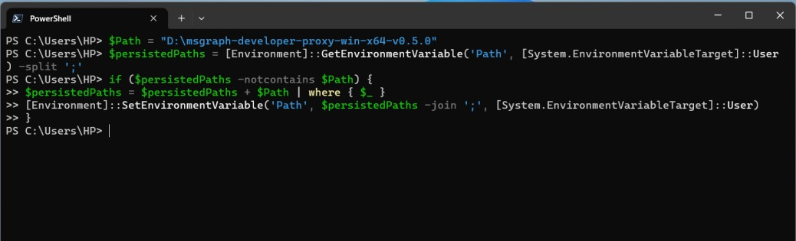
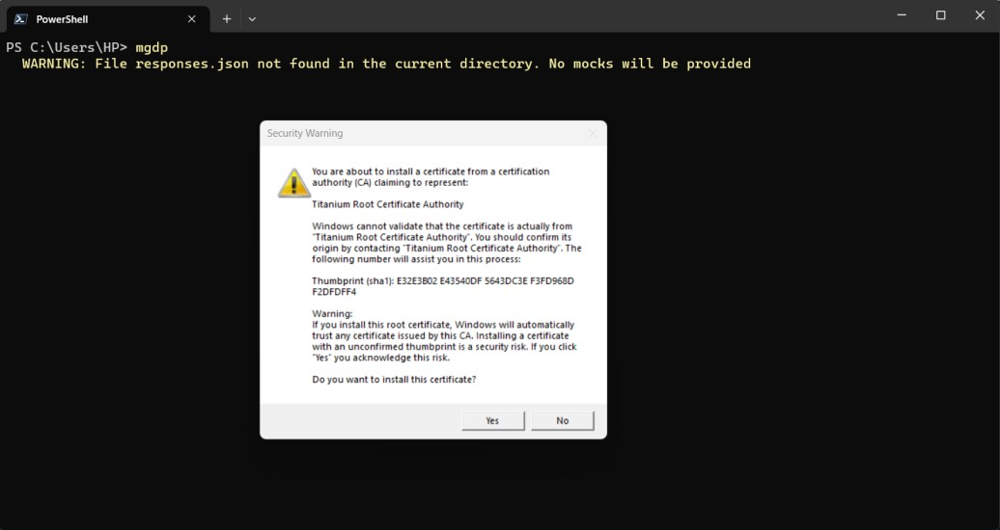
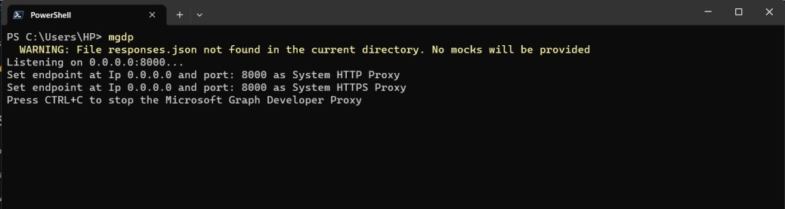
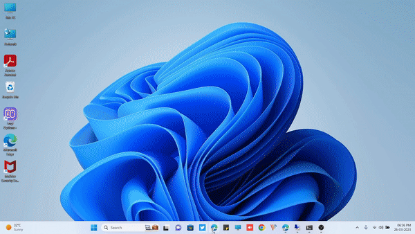

Introduction
---------------------
Graph Developer Proxy is a tool that simulates API errors using the command line. This tool works for the Microsoft Graph API but can also be extended for other APIs as well. This tool can help applications catch API errors and handle them gracefully. This tool will even help mock the API response so that we do not need to hit the server while we are developing our application.

Let us first install Graph Developer Proxy in our environment.

Installation
---------------------
The best feature of Graph Developer Proxy is that it is independent of operating systems, so we can use it in any OS (Windows, macOS, or Linux).

To install in Windows OS, follow the below steps:

1. Navigate to the below link, which will take you to the latest version of Graph Developer Proxy.

[Lastest Release](https://github.com/microsoftgraph/msgraph-developer-proxy/releases/latest)

2. Download the zip file with "win" as the keyword; you can select either x64 or x86 based on your system architecture.

3. Extract the zip file to a location of your choice.

eg. I have selected "D:\msgraph-developer-proxy-win-x64-v0.5.0"

4. Now add the above-extracted path to the environment variable and run the below command in PowerShell.
```
$Path = "D:\msgraph-developer-proxy-win-x64-v0.5.0"  
$persistedPaths = [Environment]::GetEnvironmentVariable('Path', [System.EnvironmentVariableTarget]::User) -split ';'  
if ($persistedPaths -notcontains $Path) {  
$persistedPaths = $persistedPaths + $Path | where { $_ }  
[Environment]::SetEnvironmentVariable('Path', $persistedPaths -join ';', [System.EnvironmentVariableTarget]::User)  
}
```
Note: Replace $Path value with the actual value of your Path


Test the Installation
------------------------------
Once the above steps are completed its time to check whether our installation was successful or not. To test follow the below steps

1. Open PowerShell or Command Prompt
2. Run the below command
```
mgdp
```
Note: If you face issue such as command not found, then please check whether the enviornment variable is present or not.
3. Few additional promots would be presented first time which would require 
> Trusting the certificate named Titanium Root Certificate Authority
> Allowing the firewall access





4. Finally our Graph Developer Proxy is up and running

Replicate Error 429
------------------------
To replicate error 429 for all Microsoft graph call we can use the below command and check the Microsoft graph API call using Graph Explorer

```
mgdp --no-mocks --allowed-errors 429 --failure-rate 100
```
Let us open the Graph Explorer to test our Microsoft Graph API call returning 429 error



Conclusion
---------------
It becomes very easy to replicate API errors and specially for Microsoft Graph APIs as there could be scenarious which would be difficuly to replicate without Graph Developer Proxy