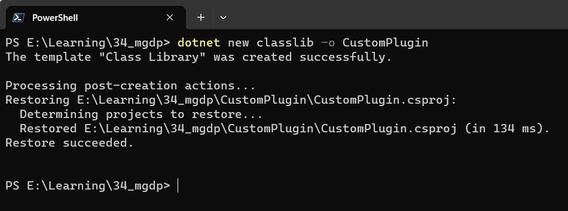
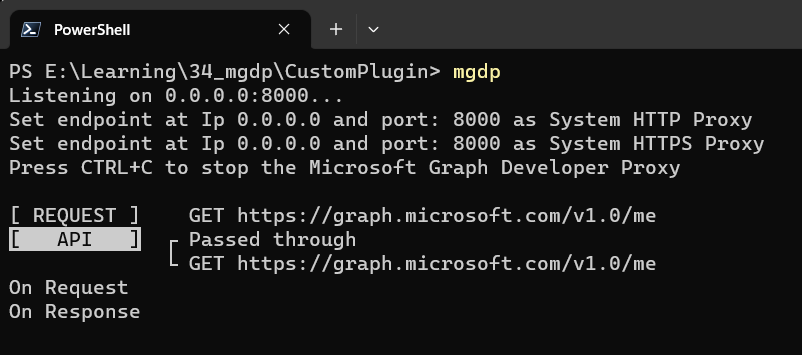

Introduction
---------------------
Graph Developer Proxy is a tool that simulates API errors using the command line. This tool works for the Microsoft Graph API but can also be extended for other APIs as well. The interesting part of the tool is you can extend it as per your requirement as well because the tool uses Plugin based architecture.

In this article we will understand what are the out of the box Plugins available and how we can customize it as per our requirement

Out of the box plugins
--------------------------

To look at all the plugins in Graph developer proxy navigate to the installed folder location and search for **appsettings.json** file. In this file all the plugins with it's available

Generic parameters for the Plugins are
1) name - Name of the plugin
2) enabled (boolean) - Whether the plugin is enabled or not
3) pluginPath(dll path) - Path of the dll where the plugin is present
4) urlsToWatch - List of URLs where the plugin would be applicable
5) configSection - If the plugin requires additional configuration a section value where the actual configurtion is present 

One of the plugin examples is as below

```
{
"name": "MockResponsePlugin",
"enabled": false,
"pluginPath": "GraphProxyPlugins\\msgraph-developer-proxy-plugins.dll",
"configSection": "mocksPlugin"
},
"mocksPlugin": {
"mocksFile": "responses.json"
},
```  

The plugins are divided into two categories 
1) Standard plugins
2) Microsoft Graph API plugins

Standard plugins
---------------------------
Plugins that are compatible with any API, along with plugins that are designed specifically for usage with the Microsoft Graph API.

| Plugin Name | Plugin Description |
|--|--|
| ODataPagingGuidancePlugin | Offers guidance to aid developers in correctly managing the retrieval of multiple pages of data. |
| RateLimitingPlugin | Enables the simulation of behaviors of APIs that return Rate-Limit headers as part of their responses. |
| MockResponsePlugin | Offers the capability to reply to requests with a simulated response. |
| ExecutionSummaryPlugin | Enables the exportation of proxy activity to a report that summarizes the activity. |

Microsoft Graph API plugins
---------------------------------------
Plugins that are designed specifically for usage with the Microsoft Graph API only.

| Plugin Name | Plugin Description |
|--|--|
| GraphSelectGuidancePlugin | Offers assistance in case the GET request does not include the $select query-string parameter. |
| GraphBetaSupportGuidancePlugin | Offers assistance when a Microsoft Graph beta endpoint is utilized. |
| GraphSdkGuidancePlugin | Offers assistance in case the Microsoft Graph SDK is not utilized.|
| GraphClientRequestIdGuidancePlugin | Offers assistance in case the client-request-id request header is missing or not utilized. |
| GraphRandomErrorPlugin | Generates random error responses for Microsoft Graph by returning a randomly selected error response from a list of supported HTTP codes. |

Custom Plugin
--------------------
Now how can we create our own custom plugin for that we need to follow the below steps
1) Create a class library project using .NET 7
```
dotnet new classlib -o CustomPlugin
```


Note: Please use .NET 7 as Graph Developer Proxy is built on .NET 7 and we would require one of the dll to be imported

2) Add a below nuget packages which are required for building custom Plugin for Microsoft graph developer proxy
```
dotnet add package Microsoft.Extensions.Configuration
dotnet add package Microsoft.Extensions.Configuration.Binder
dotnet add package Titanium.Web.Proxy
```
3) Open the project in Visual studio code and add reference to a dll msgraph-developer-proxy-abstractions by opening the CustomPlugin.csproj file and adding the below code. **Please update the file path to the dll as per your folder structure**.
Download the [dll](msgraph-developer-proxy-abstractions.dll)
```
<ItemGroup>
<Reference  Include="msgraph-developer-proxy-abstractions">
<HintPath>..\..\msgraph-developer-proxy-abstractions.dll</HintPath>
</Reference>
</ItemGroup>
```
Note : The above step would change once the dll is published to Nuget
 
[Developing custom plugin · Issue #226 · microsoftgraph/msgraph-developer-proxy (github.com)](https://github.com/microsoftgraph/msgraph-developer-proxy/issues/226)

4) To Create a custom plugin, we need to inherit from BaseProxyPlugin which is available in msgraph-developer-proxy-abstractions.dll

5) Rename class1.cs to CustomPlugin.cs and the below code

```
using  Microsoft.Extensions.Configuration;
using  Microsoft.Graph.DeveloperProxy.Abstractions;
using  System.Text.RegularExpressions;

namespace  CustomPlugin;
 
internal  class  CustomPluginConfiguration
{
public  int  Delay { get; set; } =  200;
}

public  class  CustomPlugin : BaseProxyPlugin
{
public  override  string  Name  =>  nameof(CustomPlugin);
private  CustomPluginConfiguration  _configuration  =  new();
 
public  override  void  Register(IPluginEvents  pluginEvents,
IProxyContext  context,
ISet<Regex> urlsToWatch,
IConfigurationSection?  configSection  =  null)
{
base.Register(pluginEvents, context, urlsToWatch, configSection);
configSection?.Bind(_configuration); 
pluginEvents.BeforeRequest  +=  OnRequest;
pluginEvents.AfterResponse  +=  OnResponse;
}

private  async  Task  OnResponse(object  sender, ProxyResponseArgs  e)
{
await  Task.Delay(_configuration.Delay);
_logger?.LogInfo(string.Join(Environment.NewLine, new[] { "On Response" }));
}

private  async  Task  OnRequest(object  sender, ProxyRequestArgs  e)
{
await  Task.Delay(_configuration.Delay);
_logger?.LogInfo(string.Join(Environment.NewLine, new[] { "On Request" }));
}
}
```

Note : For the example purpose we have used only two plugin events but there are many plugin events which could be leveraged as per the requirement

6) Now once the custom plugin is created build the project using the below command

```
dotnet build
```

7) Copy the dll, pdb and .deps.json file which are generated inside bin folder to the folder where the Microsoft Graph Developer Proxy is installed inside

8) Now update the appsettings.json as below inside the plugins section

 ```
 {
"name": "CustomPlugin",
"enabled": true,
"pluginPath": "GraphProxyPlugins\\CustomPlugin.dll",
"configSection": "CustomPlugin"
}
 ```
additionally add a section in appsettings.json as 

```
"CustomPlugin":{
"Delay" : 300
}
```
9) Now run Microsoft Graph Developer Proxy using the below command
```
mgdp
```



Conclusion
--------------------
By leveraging the Plugin Architecture, the Microsoft Graph Developer Proxy tool gains significant power to enable the creation of customized solutions built on top of it.