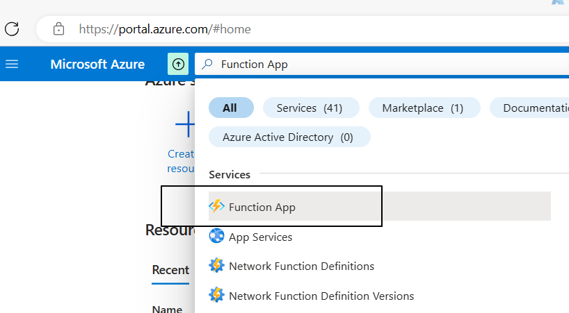
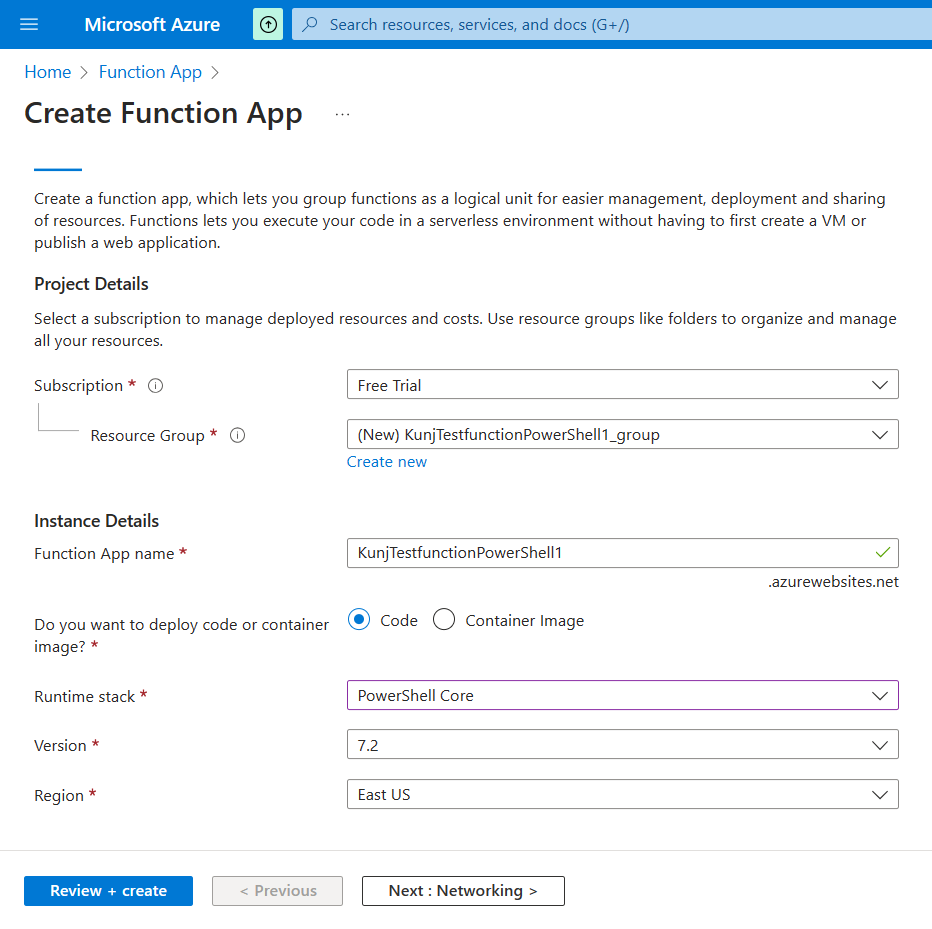
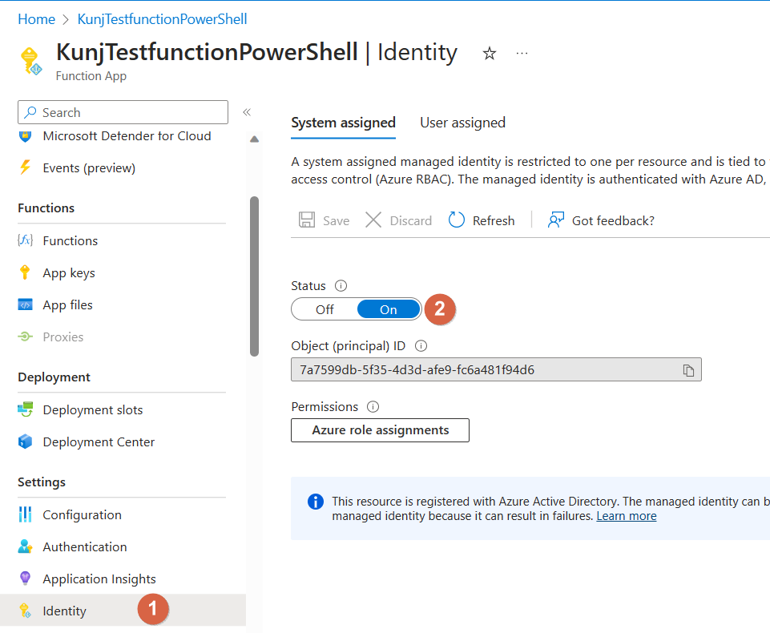
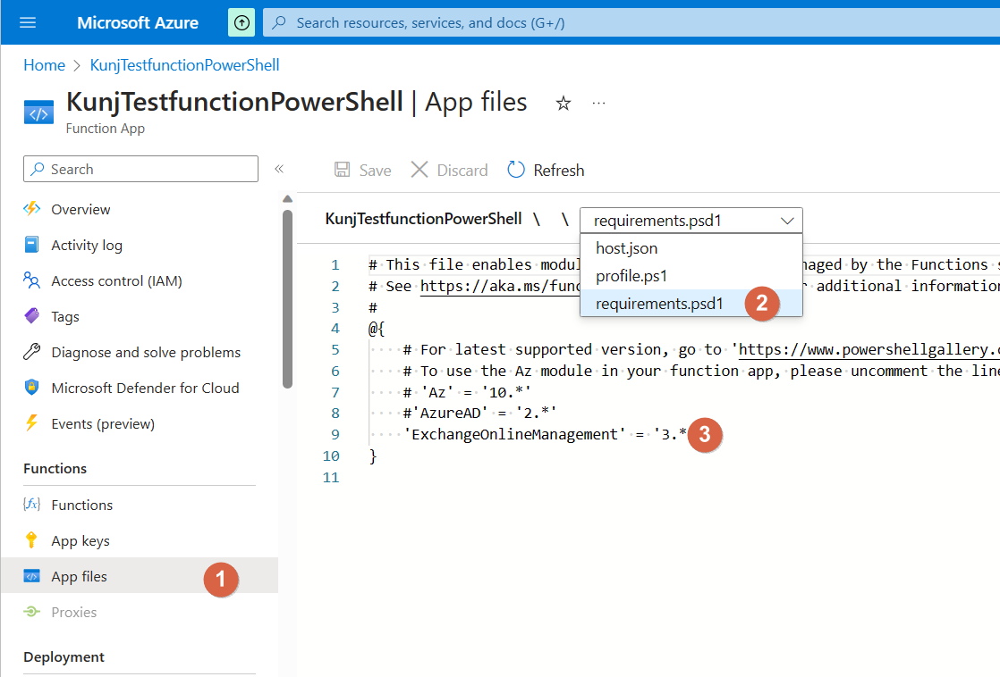
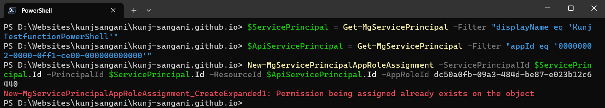
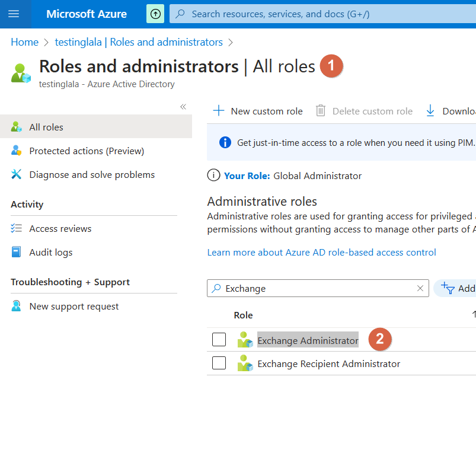
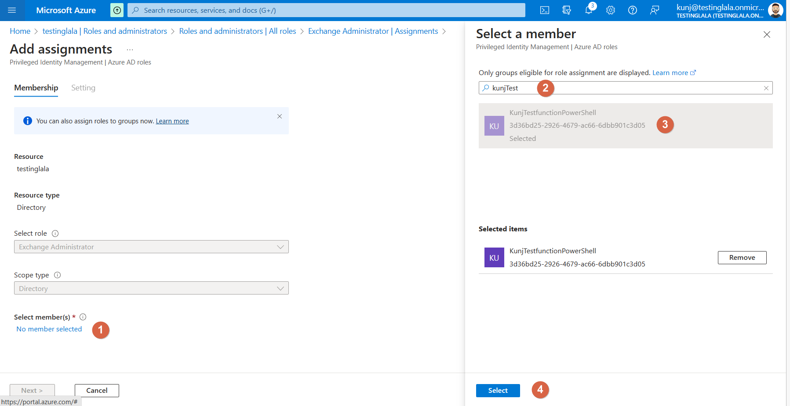
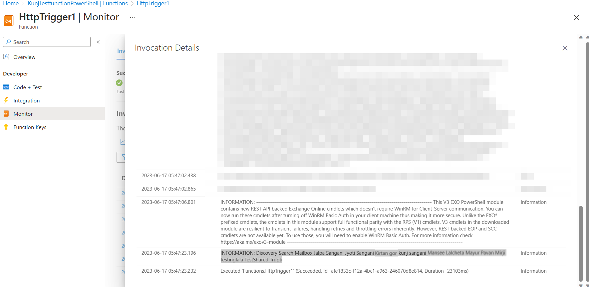

# Introduction

If we want to automate tasks in Azure we tend to prefer Azure Runbook but sometimes we would have a scenario where we want to automate the tasks using Azure Function. One such scenario is to connect to Exchange online PowerShell using Managed Identity in Azure Function

To achieve the above scenario let us divide the tasks in two sections 
1) To create Azure Function and enable Managed Identity and add Exchange Online PowerShell
2) To Provide necessary Permission to the Managed Identity 

## Section 1 Azure Function Setup

### Step 1: To Create Azure Function
(If you already have an existing function app you can skip this step)

1) Navigate to [https://portal.azure.com](https://portal.azure.com)
2) Search for Function App in the search bar and select the Function App service

3) Create a new Function App 

### Step 2:  Enable Managed Identity for the Azure Function

1) Navigate to the Azure Function App
2) Select Identity under settings
3) Change the status from Off to On and save the changes
Note: We are using System assigned Managed Identity if you want to use user assigned managed identity the steps would be 

### Step 3: Add Exchange Online PowerShell

1) Select the App files option under Functions 
2) From the dropdown select the requirements.psd1 file
3) Add the Exchange Online PowerShell Module using the below code

`'ExchangeONlineManagement' = '3.*'`

## Section 2 Managed Identity Permission

Now to use the managed Identity generated for this Azure Function for connecting exchange online we would require specific permission we can achieve this using different options like using Azure CLI or Azure AD PowerShell but for the demo, we will use Microsoft Graph PowerShell 

### Step 1: Install Microsoft Graph PowerShell 
Use the below command if not already installed

`Install-Module Microsoft.Graph`

To check if you have it already installed or not run the below command

`Get-Module -ListAvailable -Name Microsoft.Graph`

### Step 2: Connect to Microsoft Graph 
Use the below command to connect

`Connect-MgGraph -Scopes "AppRoleAssignment.ReadWrite.All","Application.ReadWrite.All","Directory.ReadWrite.All","Application.Read.All","AccessReview.ReadWrite.All","AccessReview.ReadWrite.Membership"`

### Step 3: Get the service Principals and assign permission

Connect to the manged identity

`$ServicePrincipal = Get-MgServicePrincipal -Filter "displayName eq 'KunjTestfunctionPowerShell'"`

Note: Please change the KunjTestfunctionPowerShell to the Azure Function Name of your application

`$ApiServicePrincipal = Get-MgServicePrincipal -Filter "appId eq '00000002-0000-0ff1-ce00-000000000000'"`

Note: The Id 00000002-0000-0ff1-ce00-000000000000 is for Exchange online

`New-MgServicePrincipalAppRoleAssignment -ServicePrincipalId $ServicePrincipal.Id -PrincipalId $ServicePrincipal.Id -ResourceId $ApiServicePrincipal.Id -AppRoleId dc50a0fb-09a3-484d-be87-e023b12c6440`

Note: The Id dc50a0fb-09a3-484d-be87-e023b12c6440 is Exchange.ManageAsApp 

### Step 4: Provide Exchange Administration Role

1) Navigate to [https://portal.azure.com]https://portal.azure.com
2) Select Azure Active Directory
3) Navigate to Roles and administrators
4) Search for Exchange Administrator

5) Select and provide the Azure Function name for the Exchange Administration role

## Section 3 Test Azure Function

Now create a new Azure function make it HTTP trigger and add the below command to connect to Exchange Online using Managed Identity

`$organization = "testinglala.onmicrosoft.com"`
`Connect-ExchangeOnline -ManagedIdentity -Organization $organization`

Add the below code to get all the mailboxes in the organization this is just to check if everything works as expected

`$mailbox = WriteGet-Mailbox -ResultSize unlimited`
`Write-Host $mailbox`

# Conclusion
We can leverage Managed Identity in Azure Function to connect to Exchange Online using PowerShell
