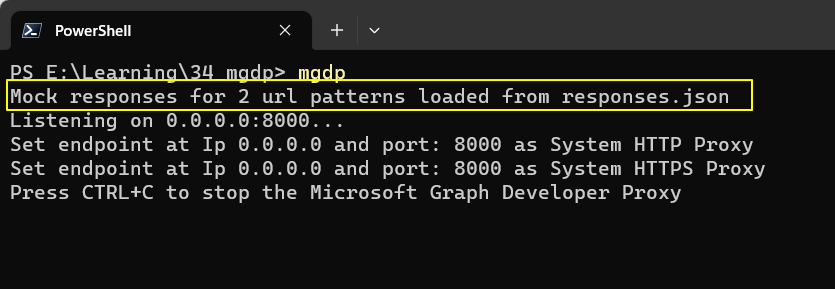
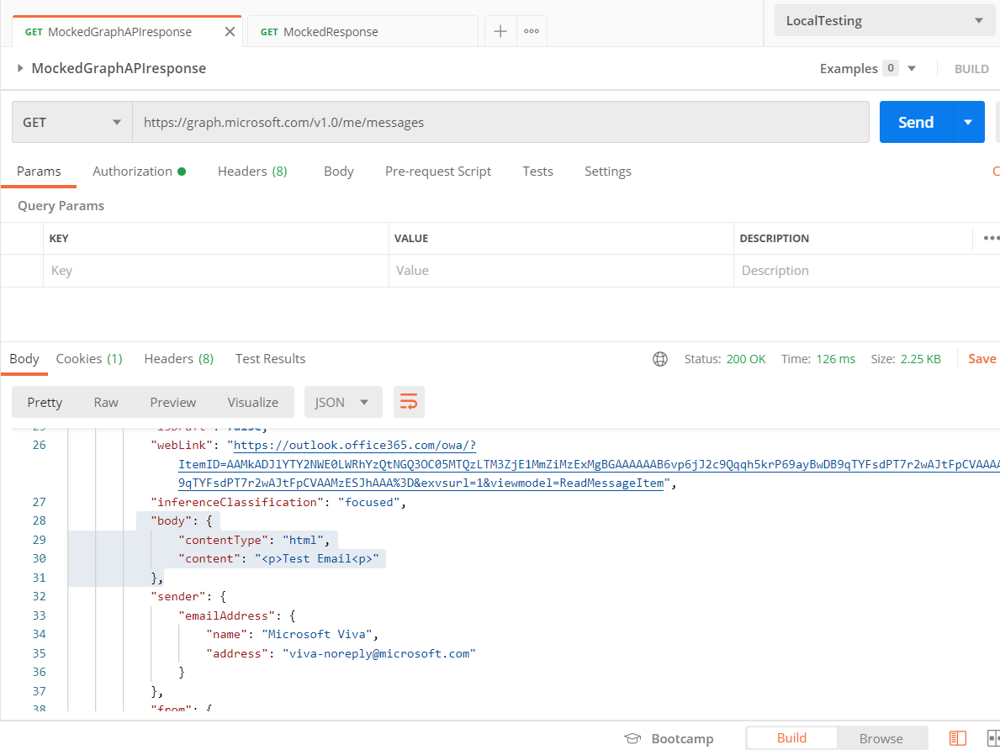
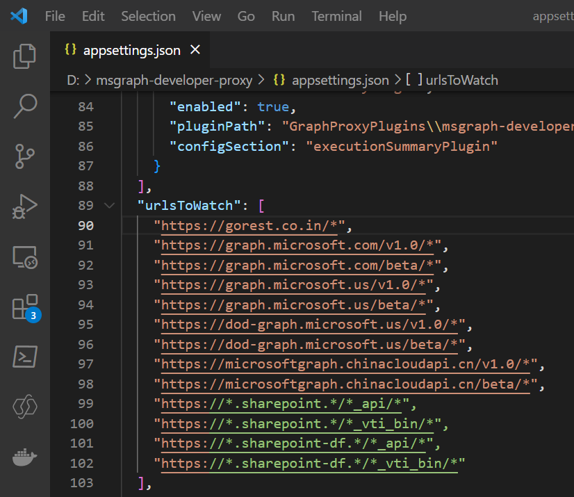
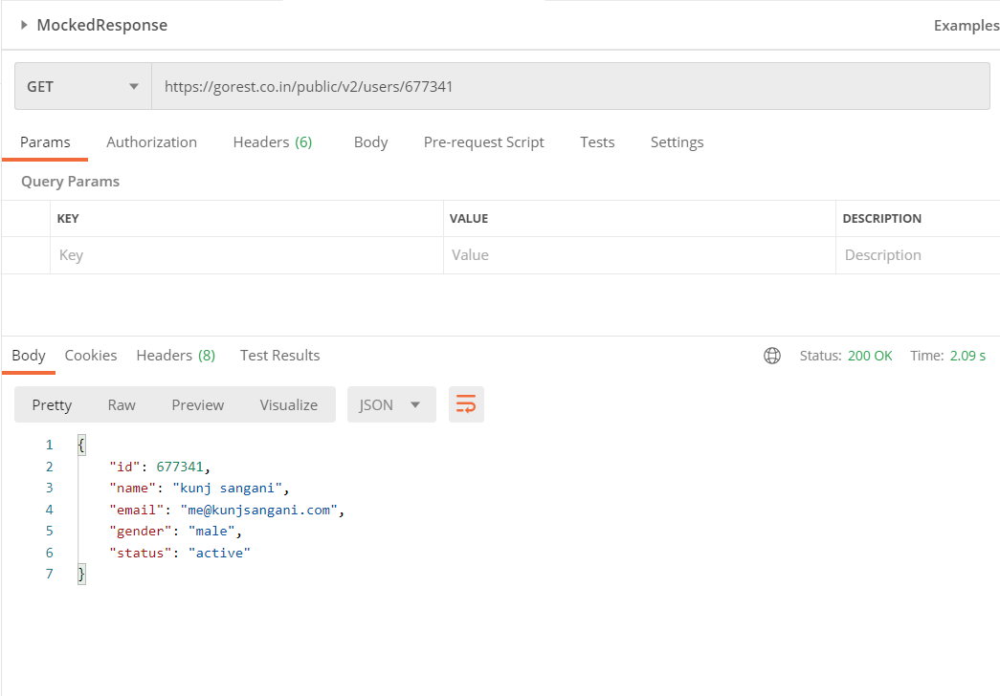

Introduction
---------------------

Graph Developer Proxy is a tool that can help mock the API response. This becomes very helpful in two scenarios.
1) When the API is not yet created and the front end teams is waiting for the APIs to be created, in this scenario we can mock the API response, and then when the actual API is ready, we can switch to the actual response.  
2) When you do not want to use the resources of your development environment for cost effectiveness, mocking the API response using a graph developer proxy can be handy.

How to mock API response using Graph Developer Proxy
---------------------
To mock the API response using Graph Developer Proxy we first want to install the Graph Developer Proxy tool if not already installed refer my article on [Overview Of Graph Developer Proxy](https://Link)

Once the installation is completed we can now mock the API response

1) Create a File named ***responses.json*** in the current directory.
Note: The response.json can be different for different projcet and can be also have a different file name

2) Open response.json in any code editor of your choice. I would use Visual studio code for mocking the response

3) Inside ***responses.json*** file we need to create an array of responses as displayed below. Each response can contain different URL , different responseBody, different method, different responseHeaders, different responseCode this can help us mock multiple APIs in a single file

4) To run and use the mocked response from Graph Developer Proxy run the below command
```
mgdp
```


5) Now let us test the response from our mocked APIs using Postman



Mock Dynamic URL reponse with Custom API
--------------------------------
What if in case you want to mock your custom API with dynamic URL example
https://gorest.co.in/public/v2/users/677343
https://gorest.co.in/public/v2/users/677341

In the URL the user id is dynamic and we do not want to mock the API for only one user id but we can to generalize the mocked reponse for all the Ids in that secanrio we just need to check our url in the responses array as

 https://gorest.co.in/public/v2/users/*

This will handle all the API request coming for all the users and would mock the response
Note: To hadle custom API we need to update ***appsettings.json*** file present in our installation folder







Conclusion
-----------------------

Graph Developer Proxy response mocking becomes very helpful when you have multiple teams for front-end and backend and want to expedite the process of development and reduce the dependency. It can also be a cost effective solution as we do not require to actually call the hosted API rather we use the mocked response